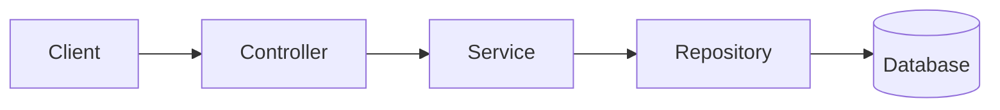

# Task Manager (Spring Boot)

   

A RESTful API for task management built with Java and Spring Boot. This project is a translation of an earlier [FastAPI version](https://github.com/ruanmarvila/gerenciador-tarefas), rebuilt to learn the Spring ecosystem: layered architecture organized by domain, JPA, Spring Security with JWT, database migrations, and automated tests.

*[Português Brasileiro](README_BR.md)*

---

# Contents:

- [Goals](#goals)
- [Features](#features)
- [Technologies](#technologies)
- [Architecture](#architecture)
- [Project Structure](#project-structure)
- [Installation](#installation)
- [API Documentation](#api-documentation)
- [Roadmap](#roadmap)
- [License](#license)

---

## Goals:

This section becomes "What I Learned" once the project is finished.

- Build a layered architecture organized by domain (`auth/`, `users/`, `tasks/`);
- Apply the Controller, Service and Repository layers with Spring's dependency injection;
- Implement JWT authentication (access and refresh tokens) with Spring Security;
- Model relational data with JPA/Hibernate and version the schema with Flyway;
- Write unit and integration tests with JUnit 5 and Mockito;
- Take the project beyond localhost: PostgreSQL, Docker, deploy and CI/CD.

---

## Features:

**Base URL:**
```
http://localhost:8080
```

| Methods | Endpoints | Features |
| :------ | :-------- | :------- |
| POST | `/auth/register` | Create a user |
| POST | `/auth/login` | Authenticate and receive access and refresh tokens
| POST | `/auth/refresh` | Refresh the expired access token|
| POST | `/auth/restore` | Restore a disabled account (within the recovery window)|
| GET | `/users/me` | Retrieve the user's information|
| PATCH | `/users/update` | Update the user's name and e-mail|
| PATCH | `/users/update/password` | Update the user's password|
| DELETE | `/users/delete` | Soft-delete the user account|
| POST | `/tasks/create` | Create a task|
| GET | `/tasks/list` | List all of the user's tasks|
| PATCH | `/tasks/update/{task_id}` | Update a task's title, description and status|
| DELETE | `/tasks/delete/{task_id}` | Soft-delete a task|
| GET | `/tasks/trash` | List all deleted tasks|
| PATCH | `/tasks/restore/{task_id}` | Restore a deleted task|
| DELETE | `/tasks/trash/empty` | Permanently delete all tasks in the trash|

---

## Technologies:

| Technology | Purpose |
| :--------- | :------ |
| Java 25 | Programming language |
| Spring Boot | Application framework |
| Spring Web | REST controllers |
| Spring Data JPA (Hibernate) | ORM and repositories |
| Spring Security | Authentication and authorization |
| jjwt | JWT generation and validation |
| Argon2 (Spring Security + Bouncy Castle) | Password hashing |
| Bean Validation | DTO validation |
| Flyway | Database migrations |
| H2 | Database during development |
| PostgreSQL | Database (planned, see [Roadmap](#roadmap)) |
| springdoc-openapi | Swagger UI |
| JUnit 5 and Mockito | Testing |
| Maven | Build and dependency management |

---

## Architecture:



Each domain owns its own Controller, Service, Repository, entities, DTOs and exceptions, instead of grouping classes by technical layer.

---

## Project Structure:

```
.
├── src/
│   ├── main/
│   │   ├── java/dev/ruancmm/gerenciador_tarefas/
│   │   │   ├── auth/           # Authentication
│   │   │   │   ├── AuthController.java
│   │   │   │   ├── AuthService.java
│   │   │   │   ├── CustomUserDetailsService.java
│   │   │   │   ├── JwtAuthFilter.java
│   │   │   │   ├── JwtUtil.java
│   │   │   │   ├── exception/
│   │   │   │   └── dto/
│   │   │   │
│   │   │   ├── users/          # User domain
│   │   │   │   ├── User.java
│   │   │   │   ├── UserController.java
│   │   │   │   ├── UserService.java
│   │   │   │   ├── UserRepository.java
│   │   │   │   ├── exception/
│   │   │   │   └── dto/
│   │   │   │
│   │   │   ├── tasks/          # Task domain
│   │   │   │   ├── Task.java
│   │   │   │   ├── TaskStatus.java
│   │   │   │   ├── TaskController.java
│   │   │   │   ├── TaskService.java
│   │   │   │   ├── TaskRepository.java
│   │   │   │   ├── TaskSpecification.java
│   │   │   │   ├── exception/
│   │   │   │   └── dto/
│   │   │   │
│   │   │   ├── core/           # Global configurations
│   │   │   │   ├── exception/
│   │   │   │   ├── security/
│   │   │   │   └── validation/
│   │   │   │
│   │   │   └── GerenciadorTarefasApplication.java
│   │   │
│   │   └── resources/
│   │       ├── db/migration/   # Flyway migrations
│   │       └── application.properties
│   │
│   └── test/
│       └── java/dev/ruancmm/gerenciador_tarefas/
│           └── GerenciadorTarefasApplicationTests.java
│
├── pom.xml
├── README_BR.md
└── README.md
```

---

## Installation:

### Prerequisites:
- Java 25 or later installed on your machine.

### Step by Step:

1. **Clone the Repository:**

```bash
    git clone https://github.com/ruanmarvila/gerenciador-tarefas-spring
```

2. **Configure the application properties:**

- Edit `src/main/resources/application.properties` (or use environment variables):

```properties
spring.datasource.url=jdbc:h2:mem:testdb;DB_CLOSE_DELAY=-1
spring.h2.console.enabled=true
spring.jpa.hibernate.ddl-auto=validate
spring.flyway.enabled=true
```

3. **Start the server:**

```bash
    ./mvnw spring-boot:run

    # Windows:
    mvnw.cmd spring-boot:run
```

Flyway runs the migrations automatically on startup.

---

## API Documentation:

Once the server is running, the interactive documentation (springdoc-openapi) is available at:
- Swagger UI: http://localhost:8080/swagger-ui.html
- OpenAPI JSON: http://localhost:8080/v3/api-docs

Protected endpoints require a token. Use `/auth/login` to obtain one, then click **Authorize** in Swagger UI and paste the access token.

---

### Examples of Request and Response:

```http
POST /auth/register
```

1. **Request:**
```json
{
    "name": "Ana",
    "email": "ana@gmail.com",
    "password": "12345678"
}
```

2. **Response (`201 CREATED`):**
```json
{
    "id": 1,
    "name": "Ana",
    "email": "ana@gmail.com"
}
```

---

## Roadmap:

### 1. Core
- [x] Project setup (Spring Initializr, Flyway, H2)
- [x] `users/`: entity, migration, repository, service
- [x] `auth/`: register, login, refresh token
- [x] `auth/`: account restore within the recovery window
- [x] `tasks/`: entity, migration, repository, service, controller
- [x] `tasks/`: trash (soft delete, restore, permanent delete)
- [x] Authorization by ownership (users only access their own tasks)

### 2. Quality
- [x] Validation with Bean Validation (DTOs)
- [x] Global exception handling (`BusinessException` hierarchy)
- [x] Swagger UI with the Bearer token scheme
- [ ] Unit tests (services) with JUnit 5 and Mockito
- [ ] Repository tests (`@DataJpaTest`) and controller tests (`MockMvc`)
- [ ] Move the JWT secret to configuration, so tokens survive restarts

### 3. Production readiness
- [ ] Switch H2 to PostgreSQL
- [ ] Containerize the application and database with Docker
- [ ] Deploy (short-lived, to get the experience of leaving localhost)
- [ ] CI/CD pipeline (build and test on every push)

### 4. Optional
- [ ] Scheduled cleanup of accounts past the recovery window (`@Scheduled`)
- [ ] Simple HTML/CSS/JS front-end (login and register) consuming the API, including CORS configuration
- [ ] AOP (logging or auditing as a study exercise)

---

## License:

This project is licensed under the [MIT License](LICENSE).