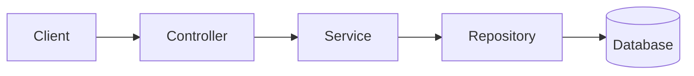

# Gerenciador de Tarefas (Spring Boot)

   

Uma API RESTful para gerenciamento de tarefas desenvolvido em Java com Spring Boot. Esse projeto é uma tradução de um projeto anterior [versão FastAPI](https://github.com/ruanmarvila/gerenciador-tarefas), redesenvolvido para aprender o ecossistema Spring: arquitetura em camadas organizada por domínio, JPA, Spring Security com JWT, migrações de banco, e testes automatizados.

---

# Índice:

- [Metas](#metas)
- [Funcionalidades](#funcionalidade)
- [Tecnologias](#tecnologias)
- [Arquitetura](#arquitetura)
- [Estrutura do Projeto](#estrutura-do-projeto)
- [Como Executar](#como-executar)
- [Documentação da API](#documentação-da-api)
- [Roteiro](#roteiro)
- [Licença](#licença)

---

## Metas:

Essa seção vai tornar-se "O que Aprendi" uma vez que o projeto termine.

- Estruturar uma arquitetura em camadas organizada por domínios (`auth/`, `users/`, `tasks/`);
- Usar as camadas de Controller, Service e Repository com a injeção de dependência do Spring;
- Implementar autenticação JWT (tokens de acesso e de renovação);
- Modelar dados relacionais com JPA/HIbernate e versionar com Flyway;
- Escrever testes unitários e de integração com JUnit 5 e Mockito;
-  Levar o projeto além do localhost: PostgreSQL, Docker, deploy e CI/CD.

---

## Funcionalidades:

**URL BASE:**
```
http://localhost:8080
```

| Método | Endpoints | Funcionalidade |
| :----- | :------- | :----------- |
| POST | `/auth/register` | Cria um usuário |
| POST | `/auth/login` | Autenticação e receber tokens de acesso e renovação|
| POST | `/auth/refresh` | Renova o *access token* expirado |
| POST | `/auth/restore`| Restaura uma conta desativada |
| GET | `/users/me` | Retorna os dados do usuário |
| PATCH | `/users/update`| Atualiza nome e e-mail |
| PATCH | `/users/update/password`| Atualiza a senha do usuário |
| DELETE  | `/users/delete`| *Soft delete* da conta |
| POST | `/tasks/create` | Cria uma tarefa |
| GET | `/tasks/list` | Lista todas as tarefas do usuário |
| PATCH | `/tasks/update/{task_id}` | Atualiza título, descrição e status |
| DELETE  | `/tasks/delete/{task_id}` | *Soft delete* de uma tarefa |
| GET | `/tasks/trash` | Lista todas as tarefas na lixeira |
| PATCH | `/tasks/restore/{task_id}`| Restaura uma tarefa da lixeira |
| DELETE | `/tasks/trash/empty` | Deleta todas as tarefas da lixeira |

---

## Tecnologias

| Tecnologias | Finalidade |
| :---------- | :--------- |
| Java 25 | Linguagem de programação |
| Spring Boot | Framework |
| Spring Web | REST controles |
| Spring Data JPA (Hibernate) | ORM e respositórios |
| Spring Security | Autenticação e autorização |
| jjwt | Geração e validação de JWT |
| Argon2 (Spring Security + Bouncy Castle) | Hash de senhas |
| Bean Validation | Validação de DTO |
| Flyway | Migração de banco |
| H2 | Banco de desevolvimento |
| PostgreSQL | Banco (planejado, veja [Roteiro](#roteiro)) |
| springdoc-openapi | Swagger UI |
| JUnit 5 e Mockito | Testes |
| Maven | Construtor e gerenciador de dependências |

---

## Arquitetura:



Cada domínio possui seu próprio Controller, Service, Repository, entidades, DTOs e exceções, em vez de agrupar classes por camada técnica.

---

## Estrutura do Projeto:

```
.
├── src/
│   ├── main/
│   │   ├── java/dev/ruancmm/gerenciador_tarefas/
│   │   │   ├── auth/           # Autenticação
│   │   │   │   ├── AuthController.java
│   │   │   │   ├── AuthService.java
│   │   │   │   ├── CustomUserDetailsService.java
│   │   │   │   ├── JwtAuthFilter.java
│   │   │   │   ├── JwtUtil.java
│   │   │   │   ├── LoginRequest.java
│   │   │   │   └── exception/
│   │   │   │
│   │   │   ├── users/          # Domínio de usuário
│   │   │   │   ├── User.java
│   │   │   │   ├── UserController.java
│   │   │   │   ├── UserService.java
│   │   │   │   ├── UserRepository.java
│   │   │   │   ├── exception/
│   │   │   │   └── dto/
│   │   │   │
│   │   │   ├── tasks/          # Domínio de tarefas
│   │   │   │   ├── Task.java
│   │   │   │   ├── TaskStatus.java
│   │   │   │   ├── TaskController.java
│   │   │   │   ├── TaskService.java
│   │   │   │   ├── TaskRepository.java
│   │   │   │   ├── TaskSpecification.java
│   │   │   │   ├── exception/
│   │   │   │   └── dto/
│   │   │   │
│   │   │   ├── core/           # Configurações globais
│   │   │   │   ├── exception/
│   │   │   │   └── security/
│   │   │   │
│   │   │   └── GerenciadorTarefasApplication.java
│   │   │
│   │   └── resources/
│   │       ├── db/migration/   # Migrações do flyway
│   │       └── application.properties
│   │
│   └── test/
│       └── java/dev/ruancmm/gerenciador_tarefas/
│           └── GerenciadorTarefasApplicationTests.java
│
├── pom.xml
├── README_BR.md
└── README.md
```

---

## Como Executar:

### Pré-requisitos:
- Java 25 ou superior instalado na máquina

### Passo a passo:

1. **Clone o Repositório:**

```bash
    git clone https://github.com/ruanmarvila/gerenciador-tarefas-spring
```

2. **Configure as propriedades da aplicação:**

- Edite `src/main/resources/application.properties` (ou use variáveis de ambiente)

```properties
spring.datasource.url=jdbc:h2:mem:testdb;DB_CLOSE_DELAY=-1
spring.h2.console.enabled=true
spring.jpa.hibernate.ddl-auto=validate
spring.flyway.enabled=true
```

3. **Inicie o servidor:**

```bash
    ./mvnw spring-boot:run

    # Windows:
    mvnw.cmd spring-boot:run
```

Flyway roda as migrações automaticamente na inicialização.

---

## Documentação da API:

Com o servidor rodando, a documentação interativa (springdoc-openapi) estará disponível em:
- Swagger UI: http://localhost:8080/swagger-ui.html
- OpenAPI JSON: http://localhost:8080/v3/api-docs

Os *endpoint* protegidos pedem um token. Use `auth/login` para obter-lo, então clique em **Authorize** no Swagger UI e cole o token de acesso (*access token*).

---

### Exemplos de Requisição e Resposta:

```http
POST /auth/register
```

1. **Requisição:**
```json
{
    "name": "Ana",
    "email": "ana@gmail.com",
    "password": "12345678"
}
```

2. **Resposta Esperada (`201 CREATED`):**
```json
{
    "id": 1,
    "name": "Ana",
    "email": "ana@gmail.com"
}
```

---

## Roteiro:

### 1. Core
- [x] Configuração do Projeto (Spring Initializr, Flyway, H2)
- [x] `users/`: entidade, migração, repository, service
- [x] `auth/`: register, login, refresh token
- [x] `auth/`: recuperação de conta com janela de arrependimento
- [x] `tasks/`: entidade, migração, repository, service, controller
- [x] `tasks/`: lixeira (*soft-delete*, recuperação, exclusão permanente)
- [x] Autorização (usuários só acessam suas próprias tarefas)

### 2. Qualidade
- [x] validação com Bean Validation (DTOs)
- [x] Tratamento global de exceções (`BusinessException`)
- [x] Swagger UI com o Bearer token
- [ ] Testes unitários (services) com JUnit 5 e Mockito
- [ ] Testes de Repository (`@DataJpaTest`) e de Controllers (`@MockMvc`)
- [ ] Mover as configurações de JWT, para os tokens sobreviverem à reinicialização

### 3. Produção
- [ ] Trocar H2 para PostgreSQL
- [ ] Containerizar a aplicação e o banco com Docker
- [ ] Deploy
- [ ] CI/CD pipeline

### Quíça
- [ ] Limpeza agendada de contas que ultrapassaram a janela de recuperação (`@Scheduled`)
- [ ] HTML/CSS/JS para um front-end simples (login e registro) consumindo a API, incluindo configuração de CORS
- [ ] AOP

---

## Licença:

Este projeto está sob a [licença MIT](LICENSE).

